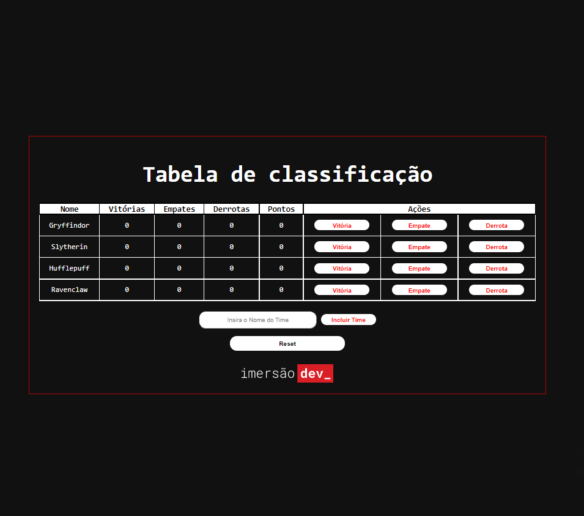

<b>> Resultado da tabela de classificação finalizada.</b>
Desenvolvido atraves da Imersão Dev da Alura.

O projeto foi desenvolvido com as seguintes tecnologias:

- [x] HTML
- [x] CSS
- [x] JavaScript

Resultado: 

## 🤝 Colaboradores

Pessoa que contribuiu para este projeto:

<table>
  <tr>
    <td align="center">
         
        
          <b>Gleysi Ferreira</b>
        
      </a>
    </td>
   </tr>
</table>